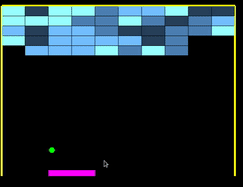

# INSTRUCTIONS
*  better use codeblocks 16 or below
*  Place the files to the folder according to instruction.jpg.
*  open new GLUT project.
*  set file location to-> minGW folder.
*  open main.cpp
*  clear it and copy-paste code, compile and run.

# DX BALL GAME
* fist copy freeglut file to the codeblock path
* then open the project and Run.
 
